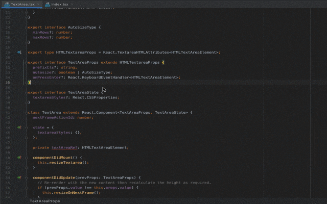

# bookmarkx4idea
> > > Description:
> During the period of code reviewing, the meeting host can insert a bookmark
and use it to log down the path of that piece of code, which some further changes will be needed
later on by other developers.

> The log can be integrated with Confluence/Jira, and assign to another developer.

## GUIDE

